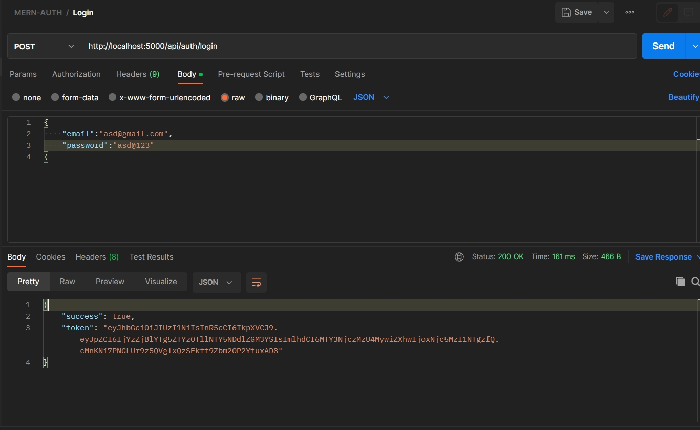
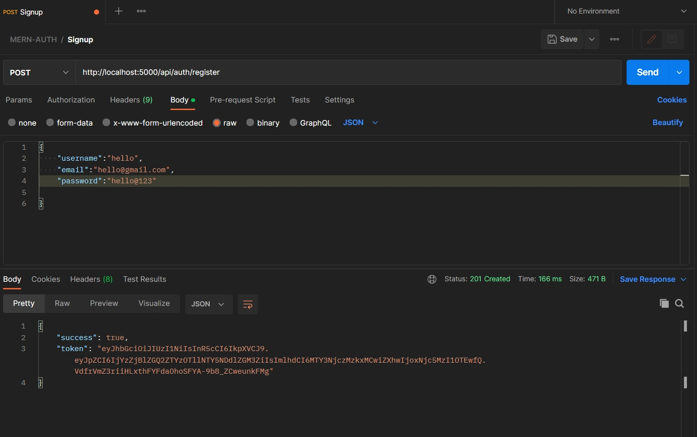

## SIMPLE MERN Authentication

## How to Use

- Clone the repository.
- Go to client directory and run command **npm install**.
- Then run **npm start** to start the development server.
- Go to server directory and create config.env file.
- Setup the environment variables.
- Run command **npm install** to install the dependencies.
- Run command **npm run server** to start the server.

## Screenshots

*Screenshot 1: Login Route*

 

*Screenshot 2: Register Route*

 

### Note* 
Forgot and reset password routes are implemented successfully but my OAuth credentials are not working properly.
